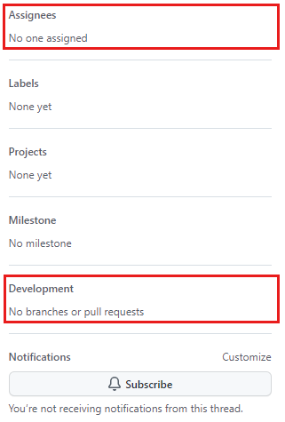

# Contribuir para um projeto de código aberto.

### Contribuir em projetos usados diariamente

1. Podemos contribuir para projetos de código aberto usados diariamente, talvez uma biblioteca que usamos em Java, Python ou NodeJS.

### Busca no GitHub

1. Podemos usar a pesquisa do GitHub para explorar tópicos e projetos por palavra-chave: https://github.com/search

2. Pesquisar por machine learning, por exemplo, irá carregar tudo relacionado a palavra-chave em questão.

3. Podemos restringir a pesquisa por tópicos, usando o menu lateral do lado esquerdo.

4. Começar a contribuir seja com código-fonte, documentação, correção ortagráfica, etc.

### Familiarize-se com um projeto de código aberto

1. Documentos no nível superior do repositório:

   1. Licença: Deverá conter uma licença de código aberto. Se não houver licença, não é de código aberto.
   2. Readme: Página de boas-vindas. Fornece informações de como começar a usar o projeto.
   3. Contribuindo: Fornece orientações de como contribuir para o projeto e detalhes de como montar o ambiente de desenvolvimento.
   4. Código de conduta:Regras básicas para os membros da comunidade.

2. Familiarizar com a comunidade, alguns canais:
   1. Verificar issues: Tarefas e melhorias relacionadas ao projeto.
   2. Pull requests: Discussão e revisão das alterações no projeto.
   3. Canais de bate-papo e fóruns: Slack, Gitter e IRC

### Identificar tarefas para trabalhar

1. Uma boa maneira de encontrar problemas para iniciantes é vistar a /contribute, por exemplo: https://github.com/jupyter/notebook/contribute

2. Acessar as [labels](https://github.com/jupyter/notebook/labels) e verificar rótulos como `help wanted`, `discussion`

### Patrocine um projeto.

1. Se um projeto for elegível para patrocínio por meio do GitHub Sponsors, você encontrará um botão (ícone de coração) Patrocinador na página principal do projeto.

## Contribuir para um repositório de código aberto

1. Passos para iniciar a contribuição

   1. Comunique a intenção aos mantenedores.
   2. Verificar se ninguém está atribuído a issue que deseja trabalhar, consultando a seção **Responsáveis**. Verifique também **Pull Request** vinculada, que significa que já tem alguém trabalhando nela.
   3. Tudo estando claro, ou seja, ninguém estiver trabalhando na issue em questão, publique um comentário sobre a issue para indicar o interesse.
   4. Exemplo de ninguém trabalhando em determinada issue:

      

//Ponto de parada: https://learn.microsoft.com/en-us/training/modules/contribute-open-source/3-contribute
