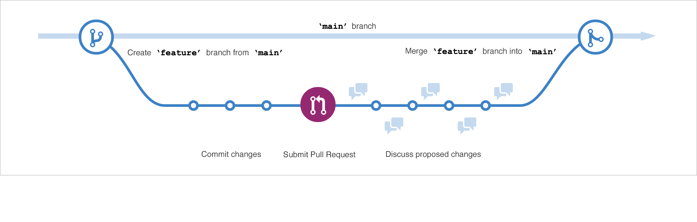

# O que é GitHub?
* O GitHub é uma plataforma baseada em nuvem que usa o Git, um sistema de controle de versão distribuído, em seu núcleo. A plataforma GitHub simplifica o processo de colaboração em projetos e fornece um site, ferramentas de linha de comando e fluxo geral que permite que desenvolvedores e usuários trabalhem juntos.

# O que é um repositório
* Um repositório contém todos os arquivos do projeto e o histórico da revisão de cada arquivo.
    * Repositórios públicos são acessíveis a todos na internet.

    * Repositórios privados são acessíveis somente a você, às pessoas com quem você compartilha explicitamente o   acesso e, no caso de repositórios de organizações, a determinados membros da organização.

# O que são gists?
* Similarmente aos repositórios, gists são uma maneira simplificada de compartilhar trechos de código com outros.
* Cada gist é um repositório Git, que você pode bifurcar e clonar e torná-lo público ou secreto. Gists públicos são exibidos publicamente, onde as pessoas podem navegar por novos conforme são criados. Gists públicos também são pesquisáveis.
* Gists: https://gist.github.com/alxss01/c9dd316f039f95d8cea7b5c58b65cfc5

# O que são wikis?
* Cada repositório no GitHub.com vem equipado com uma seção para hospedar documentação, chamada wiki.
* Usado para compartilhar conteúdo longo sobre o projeto.
* README informa rapidamente o que o projeto pode fazer. WIKI fornece documentação adicional com mais detalhes.
* Vale lembrar que se seu repositório for privado, somente pessoas que tenham pelo menos acesso de leitura ao seu repositório terão acesso ao seu wiki.

# Componentes do fluxo do GitHub

## O que são branches/ramos?
* Sua branch é um lugar seguro para experimentar novos recursos ou correções.
* Se você cometer um erro, poderá reverter suas alterações ou enviar mais alterações para corrigir o erro.
* Suas alterações não serão atualizadas na branch padrão até que você mescle (merged) sua branch.

## O que são commits
* Um commit é uma alteração em um ou mais arquivos em um branch.
* Toda vez que um commit é criado, ele recebe um ID exclusivo.
* Os commits fornecem uma trilha de auditoria clara para qualquer um que revise o histórico de um arquivo ou item vinculado
* Os estados primários para um arquivo em um repositório Git são **Untracked** e **Tracked**.
    * **Untracked**: Um estado inicial de um arquivo quando ele ainda não faz parte do repositório Git. O Git não tem conhecimento de sua existência.
    * **Tracked**: Um arquivo rastreado é aquele que o Git está monitorando ativamente. Ele pode estar em um dos seguintes subestados:
        * **Unmodified**: Não modificado. O arquivo é rastreado, mas não foi modificado desde a última confirmação.
        * **Modified**: O arquivo foi alterado desde o último commit, mas essas alterações ainda não foram preparadas para o próximo commit.
        * **Staged**: O arquivo foi modificado, e as alterações foram adicionadas à área de staging. Essas alterações estão prontas para serem confirmadas.
        * **Committed**: O arquivo está no banco de dados do repositório. Ele representa a versão mais recente do arquivo.

## O que são Pull Requests?
* Uma solicitação de pull (pull request) é o mecanismo usado para sinalizar que os commits de uma ramificação (branch) estão prontos para serem mesclados (merged) em outra ramificação (branch).
* O membro da equipe que envia o pull request pede a um ou mais revisores para verificar o código e aprovar a merge.

## Gitflow (O fluxo do GitHub)
* main >> feature >> main

* O fluxo do GitHub pode ser definido como fluxo de trabalho (GitHub Workflow)
* Pode testar novas ideias usando branches, pull requests e merge

# Plataforma colaborativa
Ponto de parada:
https://learn.microsoft.com/en-us/training/modules/introduction-to-github/4-collaborative-platform